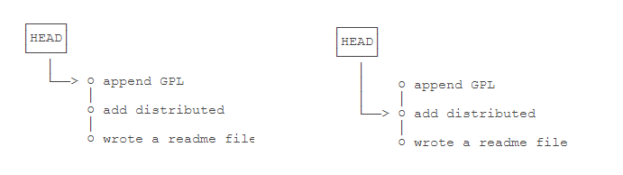

### 版本回退

- 查看历史记录

  ```bash
  $ git log
  或者
  $ git log --pretty=online //记录简洁显示
  ```

- 回退版本

  ```bash
  //回退到上个版本
  $ git reset --hard HEAD^
  
  // 回退到上上个版本
  $ git reset --hard HEAD^^
  
  //当然往上100个版本写100个^比较容易数不过来，所以写成
  $ git reset --hard HEAD~100
  
  ```

- 回到未来的版本

  ```bash
  //查看每个版本的版本号
  $ git reflog
  //回退 前进
  $ git reset --hard 1094a[未来版本的版本号，写前几位就行]
  ```

  > Git在内部有个指向当前版本的`HEAD`指针，当你回退版本的时候，Git仅仅是把HEAD指到你要到的那个版本，顺便把工作区的文件更新了

  

  

